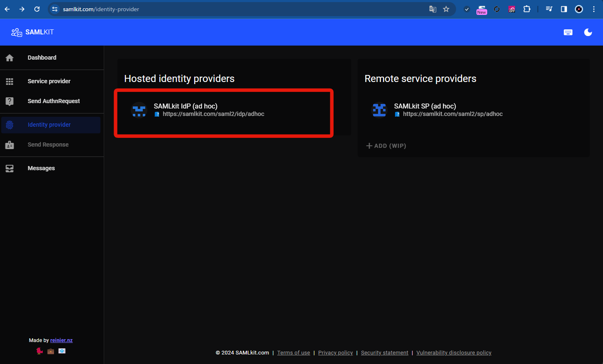

# インストール
## python環境設定

```
python -m venv saml-1-venv
source saml-1-venv/bin/activate
```

## ライブラリのインストール

```
pip install --upgrade pip
pip install flask python3-saml
```

## 実行

```
python main.py
```

# 設定方法
## samlkitでIdPの情報を取得しsettings.jsonに設定する
### samlkitのIdP情報の画面を開く
- まずはsamlkitにアクセスし、[identity providerのページ](https://samlkit.com/identity-provider)を開く
- そして、下記赤枠の「SAMLkit IdP (ad hoc)」をクリック



### IdP側の必要な情報を確認
- 下記赤枠の3つの情報をsettings.jsonに設定する
  - Entity ID
  - SSO URL
  - X.509 Certificate

### setting.jsonに設定

```json
{
  "strict": true,
  "debug": true,
  "sp": {
    "entityId": "http://localhost:5000/metadata/",
    "assertionConsumerService": {
      "url": "http://localhost:5000/acs",
      "binding": "urn:oasis:names:tc:SAML:2.0:bindings:HTTP-POST"
    },
    "singleLogoutService": {
      "url": "http://localhost:5000/sls",
      "binding": "urn:oasis:names:tc:SAML:2.0:bindings:HTTP-Redirect"
    },
    "x509cert": "",
    "privateKey": ""
  },
  "idp": {
    "entityId": "https://samlkit.com/saml2/idp/adhoc",
    "singleSignOnService": {
      "url": "https://samlkit.com/saml2/receive",
      "binding": "urn:oasis:names:tc:SAML:2.0:bindings:HTTP-Redirect"
    },
    "x509cert": "MIICpzCCAhACCQDuFX0Db5iljDANBgkqhkiG9w0BAQsFADCBlzELMAkGA1UEBhMCVVMxEzARBgNVBAgMCkNhbGlmb3JuaWExEjAQBgNVBAcMCVBhbG8gQWx0bzEQMA4GA1UECgwHU2FtbGluZzEPMA0GA1UECwwGU2FsaW5nMRQwEgYDVQQDDAtjYXByaXphLmNvbTEmMCQGCSqGSIb3DQEJARYXZW5naW5lZXJpbmdAY2Fwcml6YS5jb20wHhcNMTgwNTE1MTgxMTEwWhcNMjgwNTEyMTgxMTEwWjCBlzELMAkGA1UEBhMCVVMxEzARBgNVBAgMCkNhbGlmb3JuaWExEjAQBgNVBAcMCVBhbG8gQWx0bzEQMA4GA1UECgwHU2FtbGluZzEPMA0GA1UECwwGU2FsaW5nMRQwEgYDVQQDDAtjYXByaXphLmNvbTEmMCQGCSqGSIb3DQEJARYXZW5naW5lZXJpbmdAY2Fwcml6YS5jb20wgZ8wDQYJKoZIhvcNAQEBBQADgY0AMIGJAoGBAJEBNDJKH5nXr0hZKcSNIY1l4HeYLPBEKJLXyAnoFTdgGrvi40YyIx9lHh0LbDVWCgxJp21BmKll0CkgmeKidvGlr3FUwtETro44L+SgmjiJNbftvFxhNkgA26O2GDQuBoQwgSiagVadWXwJKkodH8tx4ojBPYK1pBO8fHf3wOnxAgMBAAEwDQYJKoZIhvcNAQELBQADgYEACIylhvh6T758hcZjAQJiV7rMRg+Omb68iJI4L9f0cyBcJENR+1LQNgUGyFDMm9Wm9o81CuIKBnfpEE2Jfcs76YVWRJy5xJ11GFKJJ5T0NEB7txbUQPoJOeNoE736lF5vYw6YKp8fJqPW0L2PLWe9qTn8hxpdnjo3k6r5gXyl8tk="
  }
}

```
